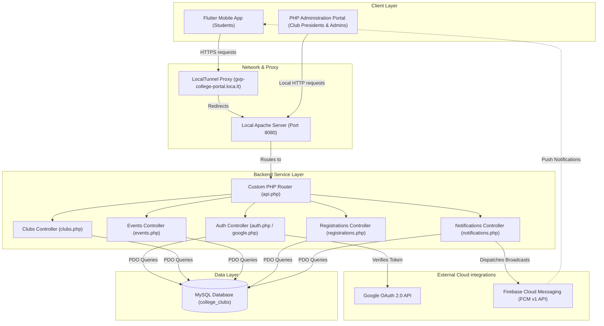
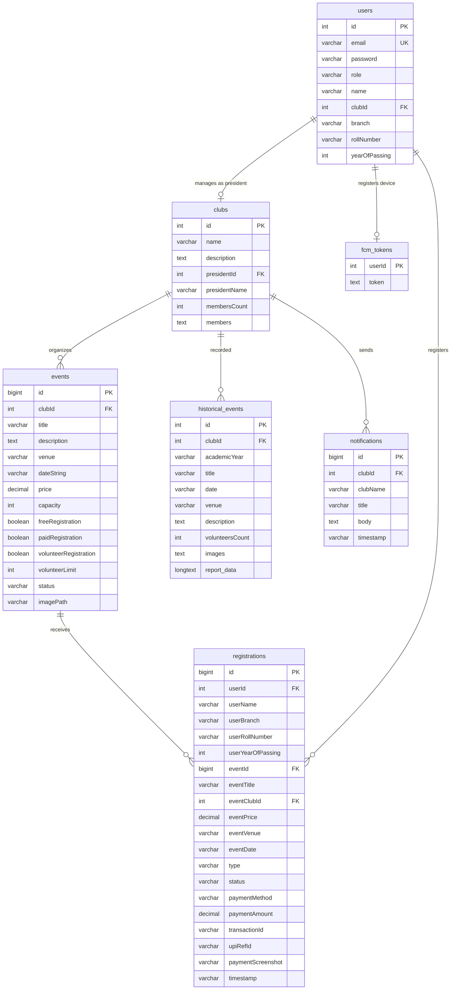

# CampusLink - College Club & Event Management System
## Project Documentation & Report (Week 1 - Completion)

CampusLink is an end-to-end event discovery, registration, and management ecosystem designed for college campus clubs. It consists of a high-performance **Flutter Mobile Application** for students to discover and register for events, a responsive **PHP Web Administration Portal** for club presidents and admins to manage events and verify attendance, and a **MySQL Database** acting as a central source of truth.

---


## 1. System Architecture

The following diagram illustrates the relationship between the mobile client, the web portal, the REST API gateway, the external cloud systems, and the underlying database.



---

## 2. Technology Stack & Key Dependencies

### 2.1 Mobile Client (Flutter & Dart)
* **Framework:** Flutter SDK (version `>=3.4.0 <4.0.0`)
* **State Management:** `provider` (version `^6.1.5+1`) for clean state updates and reactive UI.
* **Network Client:** `http` (version `^1.6.0`) to handle REST API calls to the PHP backend.
* **Authentication:** `google_sign_in` (`^6.2.1`) and `firebase_auth` (`^4.17.8`) for secure Google Single Sign-On (SSO).
* **Notification Integration:** `firebase_messaging` (`^14.8.2`) for push notifications.
* **Utility Libraries:** 
  * `qr_flutter` (`^4.1.0`) to generate dynamic QR codes representing user tickets.
  * `url_launcher` (`^6.3.1`) to handle external web links and redirect portals.

### 2.2 Web Portal & REST API (PHP & JavaScript)
* **Backend Runtime:** PHP 8.x
* **Database Interface:** PHP Data Objects (PDO) for secure, SQL-injection-free database communication.
* **Web UI Framework:** Vanilla HTML5, JavaScript (ES6), and CSS (with custom utility classes and layouts).
* **QR Verification Tool:** Integrated HTML5 webcam library for scanning QR tickets.
* **Notification Dispatch:** Google JWT validation utilizing custom service account keys to interface with Firebase Cloud Messaging (FCM) v1 HTTP endpoints.

### 2.3 Database Layer (MySQL)
* **Engine:** InnoDB
* **Collation:** `utf8mb4_unicode_ci` for flexible character encoding.
* **Hosting:** MySQL Server hosted under XAMPP/WAMP.

---

## 3. Database Schema Design

The relational schema is configured in [schema.sql](file:///e:/college/schema.sql). Below is a summary of the database structure:



### Table Details:
1. **`users`**: Stores user profiles. Role distinguishes between `admin`, `president`, and `student`. Students link their branch, roll number, and graduation year; presidents link their respective `clubId`.
2. **`clubs`**: Details of active college clubs, including executive metadata and a serialized list of members.
3. **`events`**: Details of live, upcoming events. Configures options like registration type (Free, Paid, Volunteer), ticket price, capacities, and status (`active`, `cancelled`, etc.).
4. **`historical_events`**: Stores archival details, reports, and image paths from events organized by clubs in previous academic years.
5. **`registrations`**: Connects users to events. Tracks ticket details, registration type (`participant`, `volunteer`), transaction tokens, screenshot uploads, approval statuses (`pending`, `approved`, `cancelled`), and timestamp.
6. **`notifications`**: Archive of broadcast push alerts sent out by club admins.
7. **`fcm_tokens`**: Keeps mapping of user IDs and Firebase Device tokens for targeting push notifications.

---

## 4. Week-by-Week Project Development Timeline

### Week 1: Project Setup, Database Setup & Mobile Core UI
**Objective:** Form the core architectural layout, initialize databases, create the mobile container, and establish cross-network communications.
* **Database & API Foundation:**
  * Created the initial relational database design and schemas (`schema.sql`).
  * Structured the PHP REST API project structure under `/portal/backend` with a custom router (`api.php`) handling authorization headers, environment variables parsing, and JSON utility helpers.
* **Mobile Client Initialization:**
  * Initialized the Flutter app framework (`college_clubs_mobile`).
  * Created data models for [Club](file:///e:/college/mobile/lib/models/club.dart), [Event](file:///e:/college/mobile/lib/models/event.dart), and [Registration](file:///e:/college/mobile/lib/models/registration.dart).
  * Designed the core screens:
    * Login Screen (email credentials interface).
    * Home Screen (navigation container, tabs for discovering active events, and exploring clubs).
    * Event Detail Screen (displaying description, pricing structure, date, venue, and a registration interface).
* **Cross-network Setup:**
  * Configured LocalTunnel in a script ([run_tunnel.bat](file:///e:/college/run_tunnel.bat)) targeting port `8080` (local XAMPP port) to expose the local REST endpoint externally. This bypassed development network blocks, letting physical mobile testing devices fetch live backend data.

### Week 2: Role-based Authorization, Ticketing & Web Administration
**Objective:** Add functional modules for admins and club coordinators, implement push notifications, and build out the ticketing lifecycle.
* **Authentication & Role-based Sessions:**
  * Implemented secure Google Sign-in integration using standard Firebase SDKs on the mobile frontend.
  * Created Google Token Verification endpoint (`portal/backend/routes/google.php`) to validate incoming client-side auth tokens against the Google API server, matching emails to user roles (`student` vs. `president` vs. `admin`) inside local databases.
* **Web Portal Development:**
  * Constructed the coordinator workspace (`portal/dashboard`).
  * Created the **Events Management Dashboard** supporting event creation, modifying details, pricing settings, and attendee capacity constraints.
  * Built the **Registration Verification Queue** to list pending registrations. Added verification mechanisms for paid tickets, allowing admins to inspect user-submitted transaction logs and screenshot details to approve or cancel registrations.
  * Implemented an interactive **QR Ticket Scanner** within the dashboard, allowing event coordinators to scan student tickets at the entrance using webcams.
* **Ticketing & FCM Integrations:**
  * Added dynamic QR Code generation to the Flutter application using `qr_flutter` to render ticket hashes containing registration identifiers.
  * Expanded backend routes to support FCM integration. Programmed a background token generator (`api.php`) utilizing private JSON service account credentials to interact with Firebase Cloud Messaging endpoints.
  * Added registration pipelines to support Free, Paid (UPI/card), and Volunteer requests (controlling volunteer limit counts dynamically).

### Week 3: Historical Data Migration, Bug Fixing & Polish
**Objective:** Seed real-world data, fix software edge cases, refine accessibility controls, and complete final testing.
* **Data Integration & Scraping:**
  * Added the IEEE Computer Society club to the system and imported 9 historical events to display real data.
  * Extracted, parsed, and migrated archival event records for the AIML Club and Data Science Club from previous static web repositories (`scratch/ds_repo` and `scratch/aiml_club_website`) to the central database utilizing custom PHP extraction scripts.
* **Bug Fixes & Security Hardening:**
  * Resolved a login block by updating the Data Science Club president credentials to match `dsclub@gvpce.ac.in` in seed registers.
  * Secured mobile client interfaces: Removed the floating action button (FAB) for event creation on the Home screen when a logged-in user is a student, preventing unauthorized event creation requests.
  * Refined notification payload channels to ensure push notifications correctly register across different Android/iOS versions.
  * Restored database `fcm_tokens` table compatibility for token refreshes.
* **UI Polish & Verification:**
  * Cleaned home page components by removing non-applicable "Join" options from popular clubs grids for already-registered students.
  * Updated hardcoded local network server IPs dynamically across configuration files to match Wi-Fi gateway changes during offline verification runs.
  * Completed integration testing: simulated a student registering for a paid event on mobile, uploading mock transaction receipts, verifying and approving the ticket in the admin portal, scanning the ticket QR code via the webcam tool, and broadcasting push alerts.

---

## 5. Functional Module Summary

### 5.1 Student Mobile App (Flutter)
1. **Authentication:** Quick login via Google Auth or email.
2. **Dashboard Feed:** Lists upcoming events and clubs with custom filtering and searching.
3. **Detail Interfaces:**
   * **Event View:** Interactive event status indicators (Active, Capacity Reached, etc.), registration panels, fee breakdowns, and volunteer opportunities.
   * **Club View:** Details club profiles, active student members, current executive boards, upcoming events, and archival history logs.
4. **My Tickets:** Offline-accessible tab generating event-entry QR codes.
5. **Alert Panel:** Receives and displays real-time push announcements sent out by administrators.

### 5.2 Admin Web Portal (PHP & JavaScript)
1. **Overview Panel:** Visual metrics for total registrations, current active events, database logs, and gross fee collections.
2. **Event Creator:** Interactive panel for scheduling events, configuring capacities, venues, ticket prices, and uploading cover assets.
3. **Queue Approvals:** Workspace for checking pending registrations, inspecting transaction references, and approving tickets.
4. **QR Attendance Tool:** Interactive browser screen using the client webcam to scan student QR codes, cross-checking registration ID records via local API endpoints in milliseconds.

---

## 6. Local Setup and Deployment Guide

### Prerequisites
* **Development Stack:** XAMPP, WAMP, or any Apache/MySQL environment.
* **Client Run-time:** Flutter SDK installed and path-configured.
* **NodeJS:** Installed locally for LocalTunnel exposure.

### Step 1: Database Setup
1. Launch MySQL Server (e.g., via the XAMPP Control Panel).
2. Open phpMyAdmin or your MySQL CLI client.
3. Import the [schema.sql](file:///e:/college/schema.sql) file. This automatically initializes the `college_clubs` database and seeds it with default users, clubs, and events.

### Step 2: Backend REST API Setup
1. Move the `portal` folder into your server's root folder (e.g., `C:/xampp/htdocs/college/portal`).
2. Make sure the Apache server is listening on port `8080`.
3. Open `portal/backend/config/db.php` and verify your MySQL login credentials (default is `root` with no password).
4. Run [run_tunnel.bat](file:///e:/college/run_tunnel.bat) to expose the backend server to the internet. This provides a public URL (e.g., `https://gvp-college-portal.loca.lt`).

### Step 3: Mobile App Configuration
1. Open the mobile code directory (`mobile/`).
2. Open `mobile/lib/providers/app_state.dart` and locate the server configuration values.
3. Update the `baseUrl` variable to match the Public Tunnel URL or your local machine's Wi-Fi network IP (e.g., `http://10.148.222.209/college/portal/backend/api.php`).
4. Connect a physical device or start an emulator.
5. Open terminal in the `mobile` directory and run:
   ```bash
   flutter pub get
   flutter run
   ```
